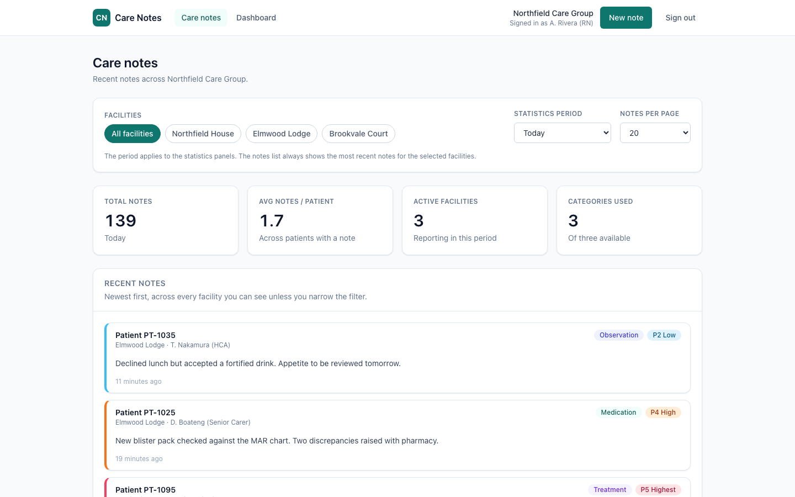
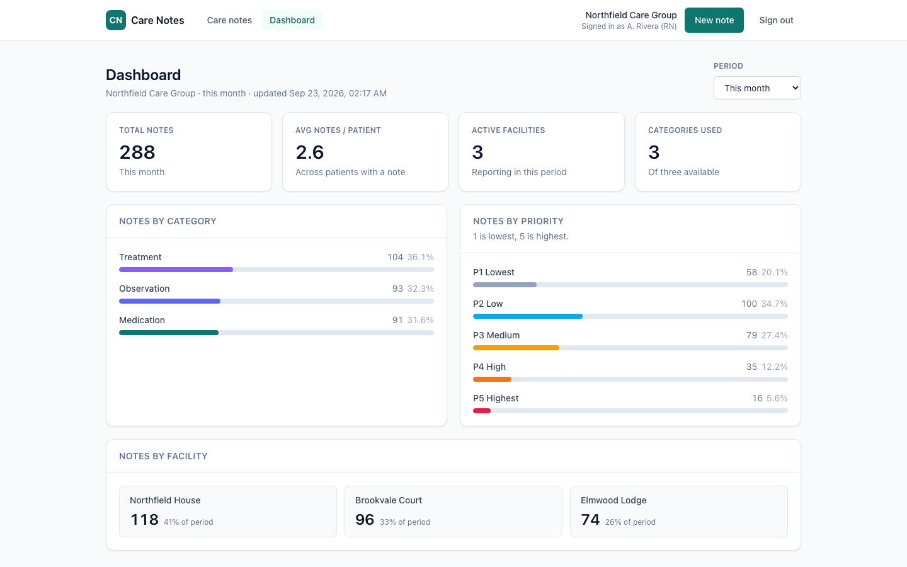
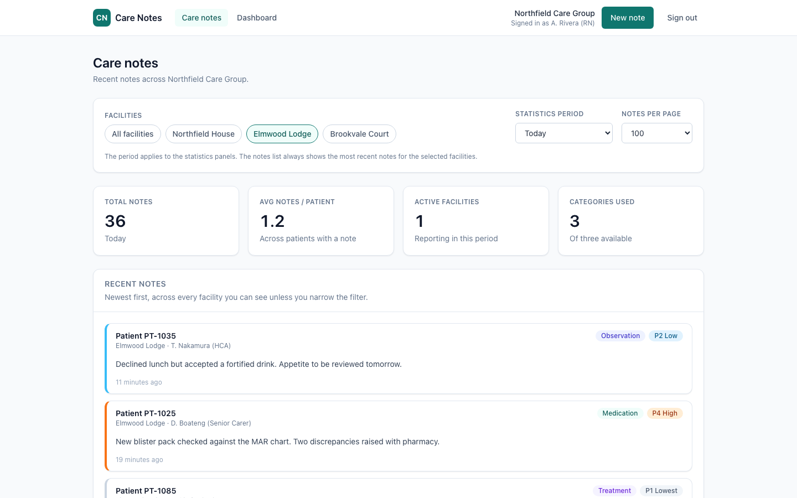
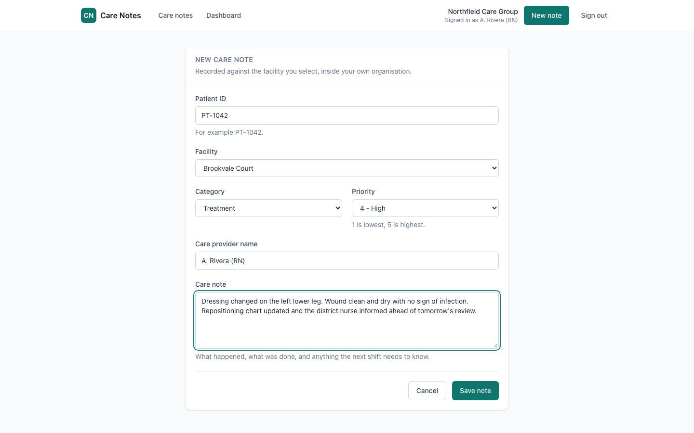
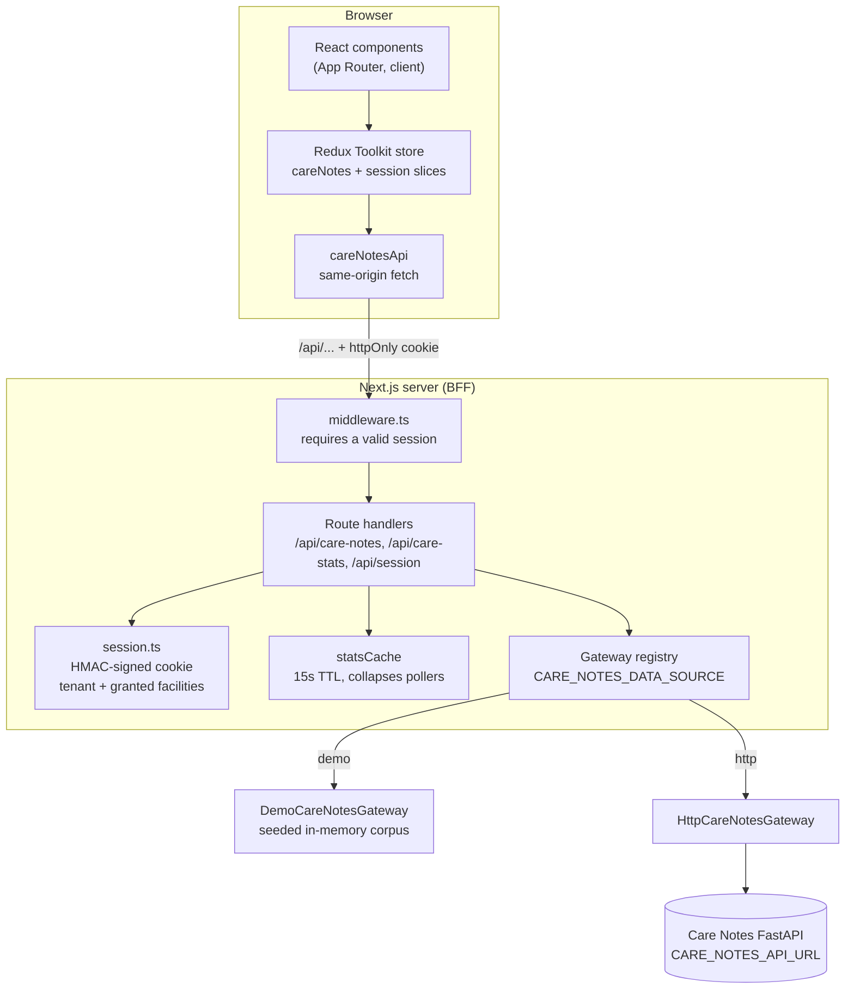
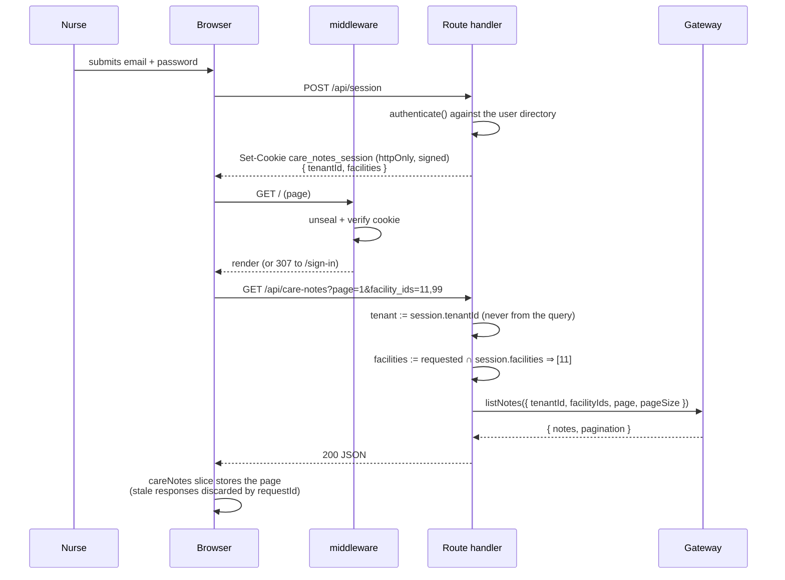

# Care Notes — Frontend

A web application for recording and reviewing care notes across a care
organisation's facilities. Staff sign in, see the notes for the facilities
their account covers, record new ones, and read aggregate statistics by
category, priority and facility.

It is a Next.js 15 App Router application. It can run entirely on its own
against a seeded synthetic dataset, or proxy a separate Care Notes FastAPI
service — the choice is one environment variable.

The application lives in **`Test-frontend/care-notes-app/`**; the Docker
setup and this README are at the repository root.

## Screenshots

Captured with Playwright at 1440×900 against the Docker image running on
seeded, entirely synthetic data (`npm run screenshots`). No real or plausible
patient data appears anywhere: patients are opaque `PT-####` codes.

| The care notes feed | The dashboard |
| --- | --- |
|  |  |

| Filtered to one facility, 100 notes per page (windowed list) | Recording a note |
| --- | --- |
|  |  |

## Architecture

The browser never talks to the care-notes backend and never chooses a tenant.
It talks to this app's own route handlers, which read the tenant out of a
signed session cookie and hand a *scoped* query to a gateway.



The pattern is a **backend-for-frontend**: a thin server layer that owns
authentication and authorisation, and a **gateway/registry** seam behind it so
the data source is swappable. Dependencies point inward — components know
about thunks, thunks know about the API client, the API client knows only
about `/api`; nothing in `src/components` or `src/views` imports anything
under `src/server`.

## Request flow

Loading the notes feed, from sign-in to rendered list:



## Quickstart

### Docker (one command, no backend required)

```bash
docker compose up --build
```

Then open **http://localhost:8170** and sign in with one of the demo accounts
shown on the sign-in page:

| Email | Password | Sees |
| --- | --- | --- |
| `a.rivera@northfield.example` | `demo-pass` | Northfield Care Group — 3 facilities, 460 notes |
| `j.okafor@lakeside.example` | `demo-pass` | Lakeside Homes — 2 facilities, 280 notes |

The container boots with `CARE_NOTES_DATA_SOURCE=demo`, so it is populated
immediately — the seed is generated in-process, there is no migration or seed
step to run. Stop it with `docker compose down -v`.

To point the same image at a real backend instead:

```bash
CARE_NOTES_DATA_SOURCE=http \
CARE_NOTES_API_URL=http://host.docker.internal:8000 \
CARE_NOTES_USERS='[{"email":"...","password_sha256":"...","name":"...","tenant_id":1,"tenant_name":"...","facilities":[{"id":11,"name":"..."}]}]' \
SESSION_SECRET="$(openssl rand -hex 32)" \
docker compose up --build
```

### Local

```bash
cd Test-frontend/care-notes-app
npm install
npm run dev          # http://localhost:3000
```

## Configuration

Every variable is read on the **server** only. There is deliberately no
`NEXT_PUBLIC_*` variable: nothing about the backend or the tenant belongs in a
browser bundle.

| Variable | Required | Default | What it does |
| --- | --- | --- | --- |
| `CARE_NOTES_DATA_SOURCE` | No | `demo` | Which gateway serves data: `demo` (seeded in-memory corpus) or `http` (proxy the FastAPI service). Unknown values fail loudly at first use. |
| `CARE_NOTES_API_URL` | Only when `http` | `http://localhost:8000` | Root URL of the Care Notes FastAPI service. The gateway appends `/api`. |
| `SESSION_SECRET` | Yes in production | a fixed development key | HMAC key for the session cookie, 16+ characters. Missing in production with `CARE_NOTES_DATA_SOURCE=http` is a startup error, not a warning. |
| `SESSION_TTL_SECONDS` | No | `28800` (8h) | Session lifetime. |
| `CARE_NOTES_USERS` | No | the two demo accounts | JSON array of accounts: `{ email, password_sha256, name, tenant_id, tenant_name, facilities: [{ id, name }] }`. When set, the demo accounts are gone and the sign-in page stops advertising them. |
| `PORT` / `HOSTNAME` | No | `3000` / `0.0.0.0` | Where the standalone server listens (set in the image). |

`SCREENSHOT_BASE_URL`, `SCREENSHOT_EMAIL` and `SCREENSHOT_PASSWORD` configure
`npm run screenshots` and are development-only.

## Development

```bash
cd Test-frontend/care-notes-app

npm run dev            # development server
npm run build          # production build — type errors and lint errors fail it
npm start              # serve the production build

npm test               # Vitest, single run
npm run test:watch
npm run type-check     # tsc --noEmit
npm run lint           # ESLint flat config: next/core-web-vitals + TypeScript
npm run format:check   # Prettier

npm run screenshots    # re-capture docs/screenshots against a running instance
```

The suite is Vitest in jsdom: **245 tests** covering the session cookie
(including tamper, wrong-secret and expiry paths), the user directory, query
parsing and facility narrowing, the stats cache, the rate limiter, both
gateways, the gateway registry, the slices and thunks (including out-of-order
responses), the selectors, the windowing maths, the polling hook, and every
screen component's loading, empty, error and populated states. `fetch` is
stubbed per test and `next/navigation` is stubbed in `vitest.setup.ts` — no
test touches the network.

## Project structure

```
.
├── Dockerfile                    # multi-stage; runtime stage is the standalone server
├── docker-compose.yml            # one command, host port 8170
├── docs/screenshots/             # README images, captured by scripts/capture-screenshots.mjs
└── Test-frontend/care-notes-app/
    ├── middleware.ts             # the single auth gate; everything is private by default
    ├── app/
    │   ├── layout.tsx            # resolves the session server-side, preloads the store
    │   ├── providers.tsx         # one store per render tree (no SSR singleton)
    │   ├── page.tsx              # "/"          -> src/views/Home
    │   ├── dashboard/page.tsx    # "/dashboard" -> src/views/Dashboard
    │   ├── add-note/page.tsx     # "/add-note"
    │   ├── sign-in/page.tsx      # the only public page
    │   ├── error.tsx             # route-level error boundary
    │   ├── healthz/route.ts      # container healthcheck
    │   └── api/                  # the BFF: care-notes, care-stats, session
    └── src/
        ├── server/               # server-only. Never imported by a component.
        │   ├── session.ts        # HMAC-signed cookie (Web Crypto: Edge + Node)
        │   ├── users.ts          # replaceable user directory
        │   ├── queryParams.ts    # parsing + "narrow to what the session grants"
        │   ├── statsCache.ts     # TTL cache in front of the aggregation
        │   ├── rateLimit.ts      # sign-in attempt limiter
        │   └── gateways/         # the extension seam: types, http, demo, registry
        ├── api/careNotesAPI.ts   # same-origin client; typed errors
        ├── app/store.ts          # makeStore(preloadedState)
        ├── features/
        │   ├── careNotes/        # slice, thunks, memoised selectors
        │   └── session/          # read-only mirror of the server session
        ├── views/                # screens
        ├── components/           # feature components
        ├── ui/                   # the design primitives everything is built from
        ├── hooks/                # usePolling, useVirtualRange, typed store hooks
        ├── utils/                # dates, priority/category tokens, shared validation
        └── test/                 # factories and the render-with-store helper
```

## Design notes

### The tenant is a server decision

The previous version had no authentication at all and picked the tenant from a
dropdown in the browser, so anyone who opened the app could read any
organisation's notes. That is the defect this revision exists to close, and a
warning in the README was not a proportionate answer to it.

What changed:

- Sign-in issues an **httpOnly, HMAC-signed session cookie** carrying the
  tenant and the facilities that account may read. It is stateless, so there
  is no session store to run, and it is signed with Web Crypto so the *same*
  module verifies it in Edge middleware and in Node route handlers.
- `middleware.ts` is a single gate: pages redirect to `/sign-in`, API routes
  answer `401`. A new route is private unless someone deliberately adds it to
  `PUBLIC_PATHS`.
- Route handlers take `tenant_id` **from the session, never from the query**,
  and intersect any requested `facility_ids` with the session's grants — an id
  belonging to another tenant is silently dropped rather than honoured.
- The facility filter in the UI is therefore a convenience. The control is on
  the server, and it is tested there.

What this deliberately is *not*: a real identity provider. `src/server/users.ts`
is a small directory read from `CARE_NOTES_USERS` (or two demo accounts). It
hashes with SHA-256 and compares in constant time, and sign-in is rate
limited, but a production deployment should replace that one file with an
OIDC callback. Nothing else would need to change — that is the point of
keeping it in one file behind one function.

### The gateway seam

`CareNotesGateway` is the only place this app knows where care notes live:

```ts
interface CareNotesGateway {
  readonly name: string
  listNotes(query: ListNotesQuery): Promise<PaginatedNotesResponse>
  getStats(query: StatsQuery): Promise<CareStats>
  createNote(command: CreateNoteCommand): Promise<CareNote>
}
```

Two implementations ship: `HttpCareNotesGateway` (the FastAPI service) and
`DemoCareNotesGateway` (a deterministic seeded corpus). `registerGateway(name,
factory)` adds a third. Every query a gateway receives is already
tenant-scoped, so a new implementation cannot accidentally widen access.

This is one seam rather than five speculative ones, and it earns its keep
immediately: it is what makes the Docker image demonstrable with no backend,
what makes the screenshots deterministic, and what lets the route handlers be
exercised without a network.

### Scalability

The real bottleneck was never rendering — it was the polling pattern and what
the browser downloaded to do it.

- **Polling discipline.** Both screens polled every 60 seconds unconditionally.
  A tab left open overnight kept a ward's aggregate query running for nobody.
  `usePolling` suspends the timer on `visibilitychange` and fires one immediate
  refresh when the tab comes back — cheaper *and* fresher.
- **Collapsing identical aggregates.** Every open tab on a ward polls the same
  `/api/care-stats` query. `statsCache` caches the in-flight promise for 15
  seconds keyed by tenant + facilities + range, so N tabs cause one upstream
  aggregation instead of N. Failures are never cached.
- **Out-of-order responses.** Changing the facility filter and the page size in
  quick succession fires two loads; the slower one used to land last and
  silently restore the state the user had moved on from. Each resource now
  records the request id it is waiting for and discards anything older. This
  was found by comparing a screenshot against what the UI should have shown.
- **Bounded pages.** The page size is selectable (20/50/100) and the server
  caps it at 100, so no single request can pull a tenant's whole table.
- **List windowing.** Above 40 rows the list becomes a fixed-height scroller
  that mounts roughly a screenful (`useVirtualRange`). Note cards are a uniform
  height, which is what makes windowing possible without measuring every row.
  Below the threshold it is inert — this is not virtualisation for its own sake,
  it exists because the page size can be raised to 100.
- **Memoisation.** Components read through `createSelector` selectors and the
  note card is `React.memo`'d, so a stats poll no longer re-renders every card
  in the list.
- **Bundle size.** MUI, Emotion, all of Radix, `recharts`, `react-hook-form`,
  `zod`, `pouchdb-browser`, `react-router-dom` and a dozen more were dependencies
  of an unused shadcn/ui scaffold and a dead CRA entry point. Removing them and
  rebuilding the UI on a small Tailwind primitive set took the dependency list
  from 57 runtime packages to 5:

  | Route | First Load JS before | after |
  | --- | --- | --- |
  | `/` | 179 kB | **123 kB** |
  | `/dashboard` | 113 kB | **119 kB** |
  | `/add-note` | 113 kB | **117 kB** |

  The route-specific chunk for `/` fell from 68.3 kB to 4.8 kB; the dashboard
  and add-note routes gained ~5 kB because they now render real charts, states
  and validation rather than near-empty markup.

### Coding standards and layering

- One `ESLint` flat config (`next/core-web-vitals` + TypeScript rules) that
  `npm run build` actually enforces. `ignoreBuildErrors` and
  `ignoreDuringBuilds` are both off — they were masking eight real type errors.
- Prettier with a checked-in config; `npm run format:check` in CI terms.
- Dead code removed rather than documented: the CRA `src/index.tsx` /
  `src/App.tsx` bootstrap, the `components/ui` scaffold, and the PouchDB cache
  that nothing imported. An offline cache that does not cache is worse than no
  offline cache.
- Validation lives in `src/utils/validateNote.ts` and is run by *both* the form
  and the route handler, so the inline messages and the server's rejection
  cannot drift. (The form previously set `noValidate` on a form whose only
  validation was `required` — i.e. none at all.)
- The care notes slice tracks `status` and `error` per resource. One shared
  `loading` flag used to make the note list flash a spinner whenever the
  independent statistics poll fired.
- The store is created per render tree. A module-level singleton would leak one
  user's tenant into the next request during server rendering.

### UI

One palette (a calm clinical teal plus a neutral ramp), one card primitive, one
button, one field wrapper, one meter. Priority runs **1 (Lowest) to 5 (Highest)**
everywhere — badge, bar, card rule and form all read from
`src/utils/priority.ts`, and the number and the word are always shown so the
colour is never the only signal. Loading states are skeletons rather than
spinners over blank space, a failed refresh keeps the last good data on screen,
and empty states say what to do next. Focus is `:focus-visible` only, there is a
skip link, and `prefers-reduced-motion` is respected.

## Backend contract

When `CARE_NOTES_DATA_SOURCE=http`, `HttpCareNotesGateway` calls
`${CARE_NOTES_API_URL}/api`:

| Method | Path | Query / body |
| --- | --- | --- |
| `GET` | `/care-notes` | `page`, `page_size`, `tenant_id`, optional comma-joined `facility_ids` → `{ notes, pagination: { total, page, page_size, total_pages } }` |
| `POST` | `/care-notes` | a `CareNoteInput` (the server adds `tenant_id` and `facility_id`) → the created `CareNote` |
| `GET` | `/care-stats` | `tenant_id`, `range`, `optimized=true`, optional `facility_ids` → `CareStats` |

`range` is one of `today`, `this_week`, `this_month`, `this_year`, `all_time`.
Types for every payload are in `src/types/index.ts`.

## Limitations

- **The user directory is a demonstration, not an IdP.** SHA-256 password
  hashes with no salt or work factor, configured through an environment
  variable. Replace `src/server/users.ts` with a real OIDC callback before
  anyone's actual credentials go near it.
- **Sessions cannot be revoked.** The cookie is stateless, so signing out
  clears it locally but a stolen cookie stays valid until `SESSION_TTL_SECONDS`
  elapses. A real deployment needs a revocation list or short-lived tokens.
- **The stats cache and the rate limiter are per-process.** Fine on one node;
  behind multiple replicas they become per-replica. Both want Redis.
- **The date-range filter applies to statistics only.** The notes list has no
  range parameter because the backend contract has none, so the list always
  shows the most recent notes. The UI says so rather than implying otherwise.
- **The demo gateway holds its corpus in memory.** Notes created against it
  disappear when the container restarts, and it is not a persistence layer.
- **No real-time updates.** Data refreshes by polling, not by websocket or SSE.
- **No offline support.** The previous PouchDB cache was removed because
  nothing used it; offline recording on ward tablets would be a genuine
  feature, and it should be designed rather than half-wired.
- **English and one locale only.** Dates are formatted `en-US`.
