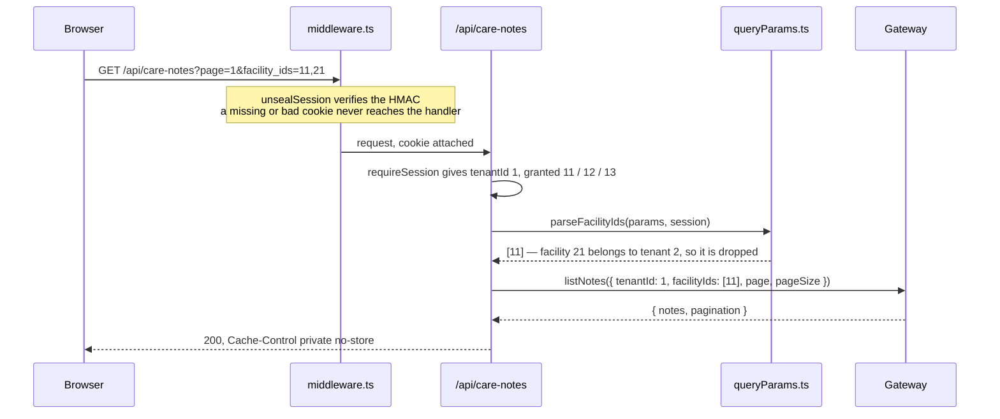
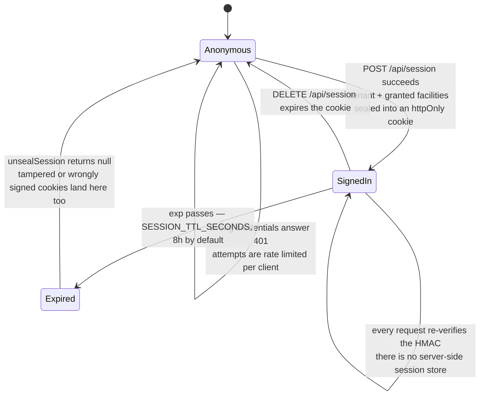
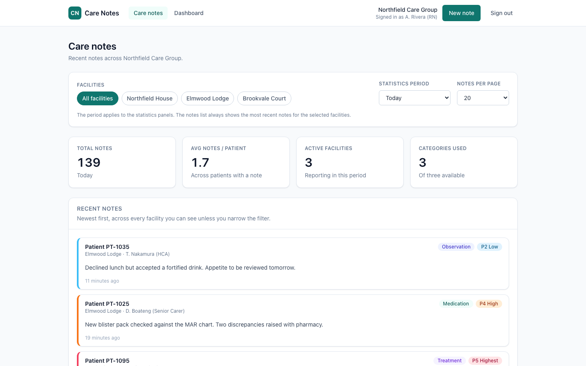
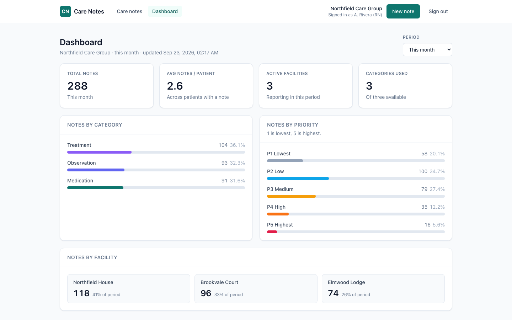
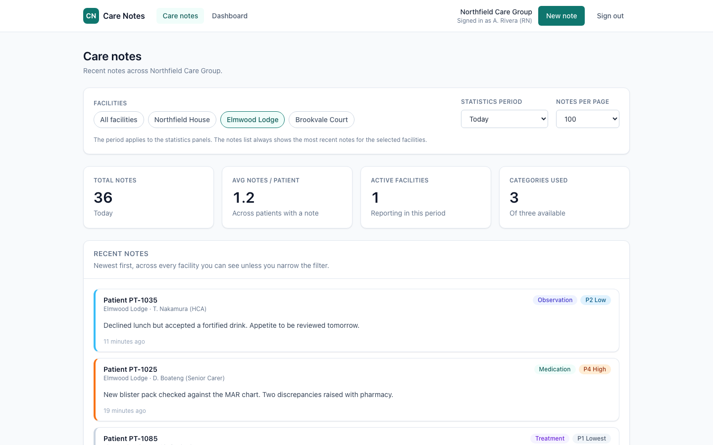
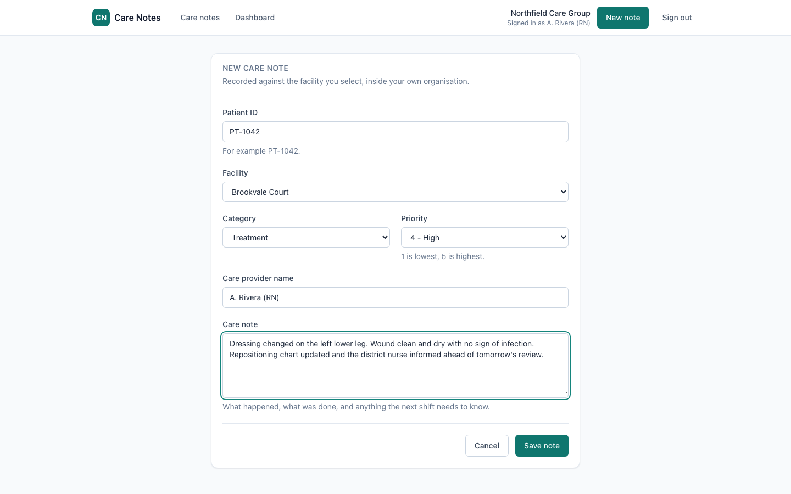

# Care Notes — Frontend

Staff at a care organisation sign in, read the notes for the facilities their
account covers, record new ones, and check aggregate statistics by category,
priority and facility. Several organisations share one deployment, so the
question that shapes the whole front end is *which* organisation the person at
the keyboard belongs to — and the browser is not allowed to answer it.

A Next.js 15 App Router application with its own thin server layer. It runs
standalone against a seeded synthetic dataset, or proxies the separate Care
Notes FastAPI service — one environment variable decides which. The app lives
in [`Test-frontend/care-notes-app/`](Test-frontend/care-notes-app/README.md).

## Who the request thinks you are

Signing in seals the tenant and the facilities that account may read into an
HMAC-signed, httpOnly cookie. Every data request is scoped from *that* value,
never from anything the browser sent:


```mermaid
sequenceDiagram
    participant B as Browser
    participant M as middleware.ts
    participant R as /api/care-notes
    participant Q as queryParams.ts
    participant G as Gateway

    B->>M: GET /api/care-notes?page=1&facility_ids=11,21
    Note over M: unsealSession verifies the HMAC<br/>a missing or bad cookie never reaches the handler
    M->>R: request, cookie attached
    R->>R: requireSession gives tenantId 1, granted 11 / 12 / 13
    R->>Q: parseFacilityIds(params, session)
    Q-->>R: [11] — facility 21 belongs to tenant 2, so it is dropped
    R->>G: listNotes({ tenantId: 1, facilityIds: [11], page, pageSize })
    G-->>R: { notes, pagination }
    R-->>B: 200, Cache-Control private no-store
```

Three pieces carry that, and each is short enough to read:

- **`middleware.ts`** is one gate in front of everything. Pages redirect to
  `/sign-in`, `/api/*` answers `401`. Only `/sign-in`, `/api/session` and
  `/healthz` are in `PUBLIC_PATHS`, so a new route is private until somebody
  deliberately opens it.
- **`app/api/*/route.ts`** read `tenant_id` from the session. There is no query
  parameter for it to read instead.
- **`src/server/queryParams.ts`** intersects a requested `facility_ids` list
  with the session's grants (`allowedFacilityIds`). An id belonging to another
  tenant is dropped rather than rejected, so a stale bookmark degrades instead
  of erroring.

The facility buttons in the UI are therefore a convenience, not the control.
The control is server-side, and so are its tests
(`src/server/queryParams.test.ts`, `src/server/session.test.ts`).

## The session, start to finish


```mermaid
stateDiagram-v2
    [*] --> Anonymous
    Anonymous --> Anonymous: a private page redirects to /sign-in<br/>and /api/* answers 401
    Anonymous --> Anonymous: wrong credentials answer 401<br/>attempts are rate limited per client
    Anonymous --> SignedIn: POST /api/session succeeds<br/>tenant + granted facilities sealed into an httpOnly cookie
    SignedIn --> SignedIn: every request re-verifies the HMAC<br/>there is no server-side session store
    SignedIn --> Anonymous: DELETE /api/session expires the cookie
    SignedIn --> Expired: exp passes — SESSION_TTL_SECONDS, 8h by default
    Expired --> Anonymous: unsealSession returns null<br/>tampered or wrongly signed cookies land here too
```

`src/server/session.ts` uses Web Crypto and nothing else, so the identical
module verifies inside Edge middleware and inside Node route handlers. The
cookie value is `base64url(payload).base64url(HMAC-SHA-256)`; `unsealSession`
collapses missing, malformed, badly signed and expired into the same `null`,
because no caller needs to tell them apart and separating them only tells an
attacker which one it was. The signature comparison is constant-time.

### The user directory is a demonstration, not an identity provider

Say this plainly: `src/server/users.ts` is a single-file directory read from
`CARE_NOTES_USERS`, or two demo accounts when that is unset. It stores SHA-256
hex digests with **no salt and no work factor**, compares them with
`timingSafeEqual`, hashes a dummy value for unknown emails so response timing
does not confirm which addresses exist, and sits behind a fixed-window limiter
of 10 sign-in attempts per client per minute (`src/server/rateLimit.ts`).

That is enough to demo and nowhere near enough for real credentials. The
intended replacement is an **OIDC callback in that one file**: everything
downstream consumes `SessionClaims`, so swapping the directory does not touch
the middleware, the handlers, the slices or a single component. Keeping it to
one file behind one `authenticate()` function is the entire point.

## The screens

Captured with Playwright at 1440×900 against the container on seeded, entirely
synthetic data (`npm run screenshots`). Patients are opaque `PT-####` codes and
staff single-initial placeholders — nothing resembles real patient data.

| The notes feed | The dashboard |
| --- | --- |
|  |  |

| Filtered to one facility, 100 notes per page | Recording a note |
| --- | --- |
|  |  |

## Run it

```bash
docker compose up --build     # http://localhost:8170
```

The image boots with `CARE_NOTES_DATA_SOURCE=demo`, so it is populated on first
start: the corpus is generated in-process, with no migration or seed step. Sign
in with one of the accounts the sign-in page advertises:

| Email | Password | Sees |
| --- | --- | --- |
| `a.rivera@northfield.example` | `demo-pass` | Northfield Care Group — 3 facilities, 460 seeded notes |
| `j.okafor@lakeside.example` | `demo-pass` | Lakeside Homes — 2 facilities, 280 seeded notes |

Stop it with `docker compose down -v`. To point the image at a real backend:

```bash
CARE_NOTES_DATA_SOURCE=http \
CARE_NOTES_API_URL=http://host.docker.internal:8000 \
SESSION_SECRET="$(openssl rand -hex 32)" CARE_NOTES_USERS='[...]' \
docker compose up --build
```

Without Docker: `cd Test-frontend/care-notes-app && npm install && npm run dev`
serves the same demo data on `http://localhost:3000`.

### What the container was verified to do

From this repository's build report: **build verified — yes**
(`docker compose build`, and `docker compose config` parses). Three stages on
`node:22-alpine` — deps, builder, runtime — with the runtime stage copying only
Next's `standalone` output, `.next/static` and `public`, so no build tooling
and no full `node_modules` ship. Final image **79 MB**, non-root `nextjs` (uid
1001), `HEALTHCHECK` on `/healthz`.

**Boot verified — yes**: `docker compose up -d` on host port 8170 reached
`healthy`, then by curl `/` returned 307 to `/sign-in`, `/api/care-notes`
unauthenticated returned 401, sign-in returned the tenant claims,
`?facility_ids=11,21` as tenant 1 returned only tenant 1 / facility 11 rows,
and `/api/care-stats` returned a populated aggregate. Torn down with
`docker compose down -v`.

## Configuration

Every variable is read on the **server** only. There is deliberately no
`NEXT_PUBLIC_*` variable: nothing about the backend, the secret or the tenant
belongs in a browser bundle.

| Variable | Required | Default | What it does |
| --- | --- | --- | --- |
| `CARE_NOTES_DATA_SOURCE` | No | `demo` | Which gateway serves data: `demo` (seeded in-memory corpus) or `http` (the FastAPI service). An unknown value throws at first use, naming the registered gateways. |
| `CARE_NOTES_API_URL` | With `http` | `http://localhost:8000` | Root URL of the Care Notes service. The gateway appends `/api`. |
| `SESSION_SECRET` | In production | a fixed development key | HMAC key for the session cookie, 16+ characters. Running `NODE_ENV=production` with a non-demo data source and no secret throws rather than warns. |
| `SESSION_TTL_SECONDS` | No | `28800` (8h) | Session lifetime. |
| `CARE_NOTES_USERS` | No | the two demo accounts | JSON array of `{ email, password_sha256, name, tenant_id, tenant_name, facilities: [{ id, name }] }`. When set, the demo accounts are gone and the sign-in page stops advertising them. Invalid JSON is fatal, not silently ignored. |
| `PORT` / `HOSTNAME` | No | `3000` / `0.0.0.0` | Where the standalone server listens (set in the image). |

## What the browser downloads

Straight out of `npm run build` on this tree:

```
Route (app)                                 Size  First Load JS
ƒ /                                      4.83 kB         123 kB
ƒ /add-note                              1.84 kB         117 kB
ƒ /dashboard                             4.17 kB         119 kB
ƒ /sign-in                               3.03 kB         104 kB
+ First Load JS shared by all                            100 kB
ƒ Middleware                             33.3 kB
```

The shared 100 kB is React and Next. Runtime dependencies are **five** —
`next`, `react`, `react-dom`, `@reduxjs/toolkit`, `react-redux` — and every
visual element is Tailwind over a small primitive set in `src/ui/` (card,
button, badge, field, meter, stat tile, spinner, state placeholders).

The rewrite that produced this tree reported the previous figures as **57
runtime dependencies** and **179 kB** First Load JS on `/` with a **68.3 kB**
route chunk — MUI, Emotion, all of Radix, `recharts`, `react-hook-form`, `zod`,
`pouchdb-browser` and `react-router-dom`, all of them dependencies of an unused
shadcn/ui scaffold and a dead CRA entry point. That tree is not in this
repository's history, so treat those as reported, not as something you can diff
here. The numbers above you can reproduce in one command.

## Polling, caching, and responses that land in the wrong order

Rendering was never the bottleneck. The data path was.

- **Polling stops when nobody is looking.** Both screens refresh every 60s.
  `usePolling` suspends the timer on `visibilitychange` and fires one immediate
  refresh when the tab returns — cheaper than polling all night for a forgotten
  tab, and fresher than waiting out an interval.
- **Identical aggregates collapse.** Every tab open on a ward polls the same
  `/api/care-stats` query, and the aggregation is the most expensive call in
  the system. `statsCache` caches the **in-flight promise** for 15 seconds,
  keyed by tenant + facilities + range, so concurrent pollers share one
  upstream call. Failures are deleted from the cache, never served.
- **Stale responses are discarded.** Changing the facility filter and the page
  size in quick succession fires two loads, and the slower one used to land
  last and restore the state the user had moved on from. It was spotted by
  looking at a captured screenshot, which showed "20 per page" after 100 had
  been selected. Each resource now records the request id it is waiting on and
  ignores anything older — three tests under the "out-of-order responses" block
  of `src/features/careNotes/careNotesSlice.test.ts` pin that.
- **Pages are bounded.** The page size is a choice of 20 / 50 / 100 and the
  server clamps it to `MAX_PAGE_SIZE = 100`, so no single request pulls a
  tenant's whole table.
- **The list windows above 40 rows** (`VIRTUALISE_ABOVE` in `NotesList.tsx`):
  a fixed-height scroller mounting roughly a screenful plus overscan. Cards are
  a uniform height, which is what makes that possible without measuring rows.
  Below the threshold it is inert — it exists because the page size goes to
  100, not for its own sake.
- **Memoised reads.** `createSelector` selectors plus `React.memo` on the note
  card, so a statistics poll no longer re-renders every card in the list.

## Talking to the FastAPI service

With `CARE_NOTES_DATA_SOURCE=http`, `HttpCareNotesGateway` calls
`${CARE_NOTES_API_URL}/api`:

| Method | Path | Sends |
| --- | --- | --- |
| `GET` | `/care-notes` | `page`, `page_size`, `tenant_id`, optional comma-joined `facility_ids` → `{ notes, pagination: { total, page, page_size, total_pages } }` |
| `POST` | `/care-notes` | the note plus `tenant_id` and `facility_id`, both supplied by the route handler → the created `CareNote` |
| `GET` | `/care-stats` | `tenant_id`, `range`, `optimized=true`, optional `facility_ids` → `CareStats` |

`range` is one of `today`, `this_week`, `this_month`, `this_year`,
`all_time`. Payload types are in `src/types/index.ts`. Upstream 5xx is
reported to the browser as 502 so a backend stack trace cannot leak through.

**These two repositories have not been run against each other.** The sibling
`care-notes-test-backend` takes the tenant from a client-supplied
`X-Tenant-ID` header and answers 400 without it — a stand-in for a verified JWT
claim which that README is explicit is *not* authentication. This gateway sends
`tenant_id` as a query parameter and no such header, and `optimized=true` has
no counterpart there either. Wiring the two together is an edit to
`httpGateway.ts`: the tenant is already in hand, it just has to travel in a
header. Nothing about the checks described further up changes — they happen in
this app's own handlers, before any gateway is called.

Swapping the data source entirely is the same size of change.
`CareNotesGateway` (`src/server/gateways/types.ts`) has three methods, two
implementations ship, and `registerGateway(name, factory)` adds a third. Every
query one receives is already tenant-scoped, so a new implementation cannot
widen access even by accident.

## Working in the repo

```bash
cd Test-frontend/care-notes-app

npm run dev            # development server
npm run build          # production build — type and lint errors fail it
npm test               # Vitest, single run
npm run type-check     # tsc --noEmit
npm run lint           # ESLint flat config, next/core-web-vitals + TypeScript
npm run format:check   # Prettier
npm run screenshots    # re-capture docs/screenshots (SCREENSHOT_BASE_URL etc.)
```

`npm test` is **245 tests across 26 files**, jsdom, no network — `fetch` is
stubbed per test and `next/navigation` in `vitest.setup.ts`. They cover session
sealing and unsealing (tamper, wrong secret, expiry, malformed cookie), the
user directory, facility narrowing, the stats cache including its stampede
collapse, the rate limiter, both gateways and the registry, the slices, thunks
and selectors, the windowing maths, polling visibility behaviour, and each
screen's loading, empty, error and populated states.

```
Test-frontend/care-notes-app/
├── middleware.ts            # the single auth gate
├── app/
│   ├── layout.tsx           # resolves the session server-side, preloads the store
│   ├── providers.tsx        # one store per render tree, never a module singleton
│   ├── sign-in/             # the only public page
│   ├── healthz/route.ts     # liveness probe, reports the live gateway name
│   └── api/                 # care-notes, care-stats, session
└── src/
    ├── server/              # server-only: session, users, queryParams,
    │   └── gateways/        #   statsCache, rateLimit, and the data-source seam
    ├── api/careNotesAPI.ts  # same-origin client, typed errors
    ├── features/            # careNotes (data, filters, pagination) + session
    ├── views/ components/   # screens and the components they are built from
    └── ui/ hooks/ utils/    # primitives, usePolling/useVirtualRange, validation
```

Two rules hold the layering up, and both are checkable: nothing under
`src/components`, `src/views`, `src/ui`, `src/hooks`, `src/features` or
`src/api` imports anything from `src/server`, and `src/utils/validateNote.ts`
is run by the form *and* by the POST handler, so inline messages and server
rejections cannot drift. Priority runs **1 (Lowest) to 5 (Highest)**
everywhere, from one table in `src/utils/priority.ts`, and the number and the
word are always shown together so colour is never the only signal.

## Known gaps

- **Unsalted SHA-256 password hashes, configured by environment variable.**
  Covered above — replace `src/server/users.ts` before real credentials go
  anywhere near this.
- **Sessions cannot be revoked.** The cookie is stateless, so signing out
  clears it locally but a stolen cookie stays valid until `exp`. A real
  deployment needs short-lived tokens or a revocation list.
- **The stats cache and the rate limiter are per-process** — fine on one node,
  per-replica behind several. Both want Redis.
- **The date-range control applies to statistics only.** The notes list has no
  range parameter because the backend contract has none, so it always shows the
  most recent notes. The control is labelled "Statistics period" and says so
  under the filter bar rather than implying otherwise.
- **The demo gateway holds its corpus in memory** — notes created against it
  disappear on restart. It is a fixture, not a persistence layer.
- **No real-time updates and no offline support.** Data arrives by polling.
  Offline recording on ward tablets would be a real feature and deserves
  designing rather than half-wiring.
- **One locale.** Dates are formatted `en-US` throughout.
